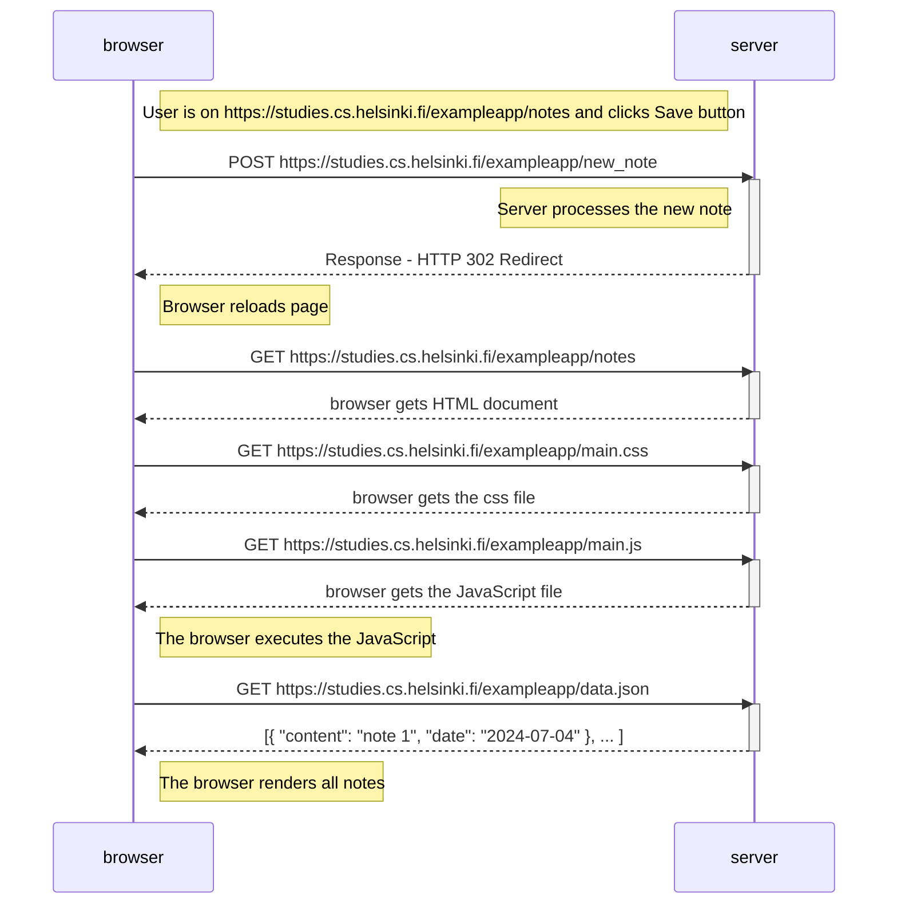

```mermaid
sequenceDiagram
participant browser
participant server

    Note right of browser: User is on https://studies.cs.helsinki.fi/exampleapp/notes and clicks Save button

    browser->>server: POST https://studies.cs.helsinki.fi/exampleapp/new_note
    activate server
    Note left of server: Server processes the new note
    server-->>browser: Response - HTTP 302 Redirect
    deactivate server

    Note right of browser: Browser reloads page
    browser->>server: GET https://studies.cs.helsinki.fi/exampleapp/notes
    activate server
    server-->>browser: browser gets HTML document
    deactivate server

    browser->>server: GET https://studies.cs.helsinki.fi/exampleapp/main.css
    activate server
    server-->>browser: browser gets the css file
    deactivate server

    browser->>server: GET https://studies.cs.helsinki.fi/exampleapp/main.js
    activate server
    server-->>browser: browser gets the JavaScript file
    deactivate server

    Note right of browser: The browser executes the JavaScript

    browser->>server: GET https://studies.cs.helsinki.fi/exampleapp/data.json
    activate server
    server-->>browser: [{ "content": "note 1", "date": "2024-07-04" }, ... ]
    deactivate server

    Note right of browser: The browser renders all notes
```
