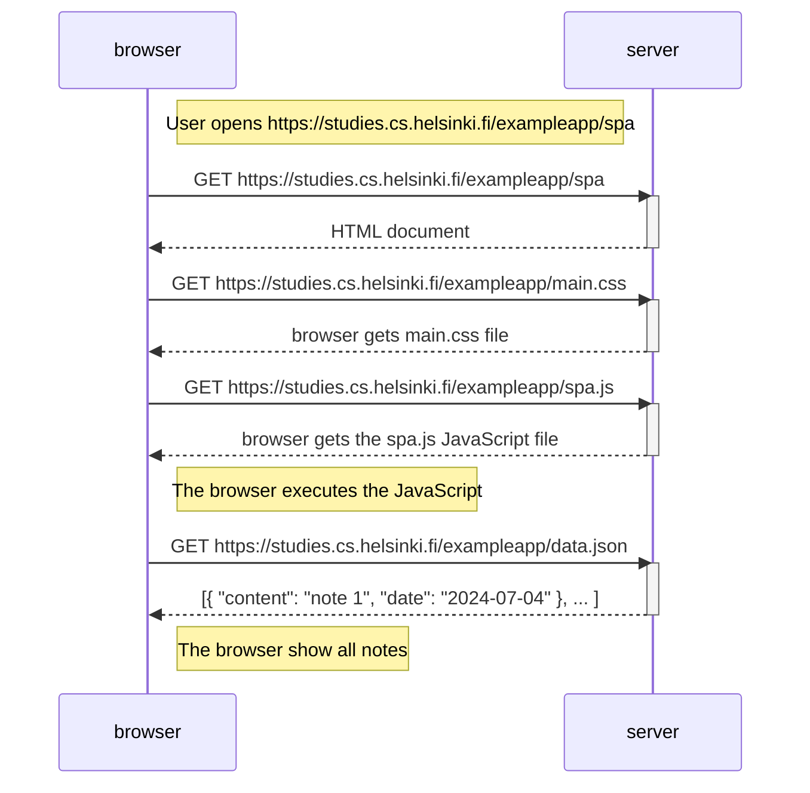

```mermaid
sequenceDiagram
participant browser
participant server

    Note right of browser: User opens https://studies.cs.helsinki.fi/exampleapp/spa

    browser->>server: GET https://studies.cs.helsinki.fi/exampleapp/spa
    activate server
    server-->>browser: HTML document
    deactivate server

    browser->>server: GET https://studies.cs.helsinki.fi/exampleapp/main.css
    activate server
    server-->>browser: browser gets main.css file
    deactivate server

    browser->>server: GET https://studies.cs.helsinki.fi/exampleapp/spa.js
    activate server
    server-->>browser: browser gets the spa.js JavaScript file
    deactivate server

    Note right of browser: The browser executes the JavaScript
    browser->>server: GET https://studies.cs.helsinki.fi/exampleapp/data.json
    activate server
    server-->>browser: [{ "content": "note 1", "date": "2024-07-04" }, ... ]
    deactivate server
    Note right of browser: The browser show all notes
```
