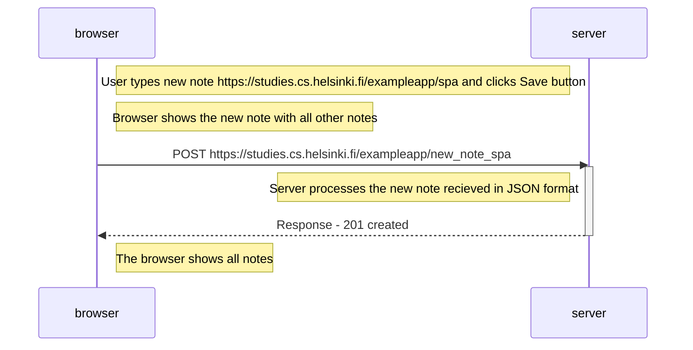

```mermaid
sequenceDiagram
participant browser
participant server

    Note right of browser: User types new note https://studies.cs.helsinki.fi/exampleapp/spa and clicks Save button
    Note right of browser: Browser shows the new note with all other notes

    browser->>server: POST https://studies.cs.helsinki.fi/exampleapp/new_note_spa
    activate server
    Note left of server: Server processes the new note recieved in JSON format
    server-->>browser: Response - 201 created
    deactivate server

    Note right of browser: The browser shows all notes
```
